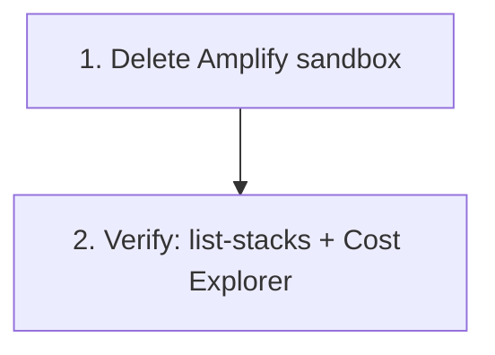
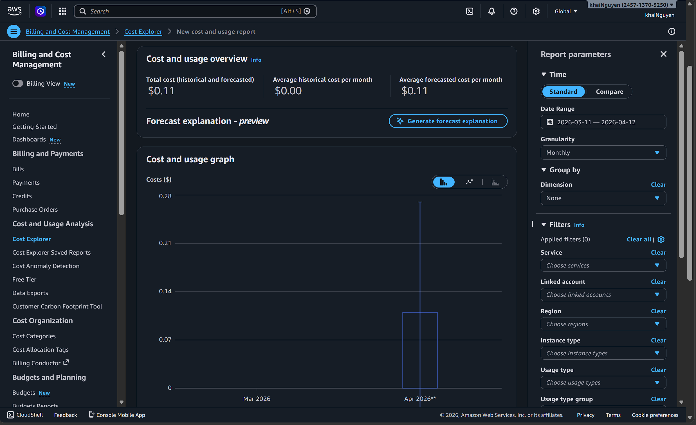

# 4.10 Cleanup

Run this section the same day you finish the workshop. AWS will happily bill you for idle Fargate tasks, Bedrock-enabled NAT traffic, and orphaned ALBs forever if you let it. Follow the steps **in order** — several resources cannot be deleted until their dependents are gone first.

## Order of Operations



## 1. Delete the Amplify Sandbox

From `backend/`:

```bash
cd backend
npx ampx sandbox delete
```

Confirm the prompt. This tears down the CloudFormation stack prefixed `amplify-nutritrack-tdtp2--` along with its Cognito pool, AppSync API, Lambdas, and DynamoDB tables suffixed `tynb5fej6jeppdrgxizfiv4l3m`.

If the command fails because the S3 bucket is not empty, empty it first with step 3 and retry.


## 2. Verify Everything Is Gone

### Stacks

```bash
aws cloudformation list-stacks \
  --stack-status-filter CREATE_COMPLETE UPDATE_COMPLETE
```

No stack in the output should contain `NutriTrack`, `amplify-nutritrack`, or `amplify-d1glc6vvop0xlb`.

### Cost Explorer

Open **Billing → Cost Explorer**, filter by service for Bedrock, Fargate, DynamoDB, AppSync, and S3. Daily costs should trend to zero within **24 to 48 hours** of the cleanup. If a service is still accruing after 48 hours, something is still running — go back through the list above.

### Billing dashboard screenshot



## What NOT to Delete

The following can be kept safely and reused for other projects:

- **Google Cloud OAuth client** — no ongoing cost, and recreating it means updating every Cognito config that uses it.
- **Your own IAM admin user** — the one you started the workshop with. Only delete the *dedicated* workshop user if you created one.
- **AWS Budgets alerts** — cost nothing, keep protecting you.
- **CloudTrail** — keep for audit history.
- **AWS-managed service-linked roles** — these are shared across services; deleting them breaks unrelated things.
- **Route 53 hosted zones you did not create for this workshop.**

If you are unsure about a resource, leave it. An orphaned IAM role costs nothing. An accidentally deleted production role costs hours of recovery.
