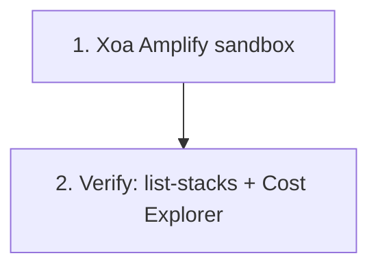

# 4.10 Dọn dẹp

Chạy phần này ngay trong ngày bạn kết thúc workshop. AWS sẽ vui vẻ tính tiền cho Fargate task idle, traffic NAT phục vụ Bedrock, và ALB mồ côi vô thời hạn nếu bạn để mặc. Làm các bước **theo thứ tự** — nhiều tài nguyên không thể xóa cho đến khi các dependent của chúng biến mất trước.

## Thứ tự thao tác



## 1. Xóa Amplify Sandbox

Từ `backend/`:

```bash
cd backend
npx ampx sandbox delete
```

Xác nhận prompt. Lệnh này gỡ CloudFormation stack tiền tố `amplify-nutritrack-tdtp2--` kèm Cognito pool, AppSync API, Lambda, và các bảng DynamoDB hậu tố `tynb5fej6jeppdrgxizfiv4l3m`.

Nếu lệnh fail vì S3 bucket không rỗng, làm trống bucket ở bước 3 trước rồi chạy lại.


## 2. Xác minh mọi thứ đã biến mất

### Stack

```bash
aws cloudformation list-stacks \
  --stack-status-filter CREATE_COMPLETE UPDATE_COMPLETE
```

Kết quả không được chứa stack nào với `NutriTrack`, `amplify-nutritrack`, hay `amplify-d1glc6vvop0xlb`.

### Cost Explorer

Mở **Billing → Cost Explorer**, filter theo service cho Bedrock, Fargate, DynamoDB, AppSync, và S3. Chi phí hằng ngày phải về gần 0 trong vòng **24 đến 48 giờ** sau cleanup. Nếu sau 48 giờ vẫn có service phát sinh chi phí, còn gì đó đang chạy — quay lại rà lại danh sách ở trên.

### Ảnh chụp dashboard billing


## Những thứ KHÔNG nên xóa

Những thứ dưới đây nên giữ lại và tái sử dụng cho project khác:

- **Google Cloud OAuth client** — không tốn phí, và tạo lại sẽ phải cập nhật mọi cấu hình Cognito đang dùng nó.
- **IAM admin user của chính bạn** — cái mà bạn dùng để bắt đầu workshop. Chỉ xóa user *dành riêng* cho workshop nếu bạn có tạo.
- **AWS Budgets alert** — miễn phí, giữ lại để bảo vệ bạn.
- **CloudTrail** — giữ lại cho lịch sử audit.
- **Service-linked role do AWS quản lý** — dùng chung giữa các service; xóa sẽ làm hỏng thứ khác không liên quan.
- **Route 53 hosted zone không phải do workshop này tạo ra.**

Nếu không chắc về một tài nguyên, để nguyên. IAM role mồ côi không tốn tiền. Xóa nhầm role production tốn vài giờ phục hồi.
