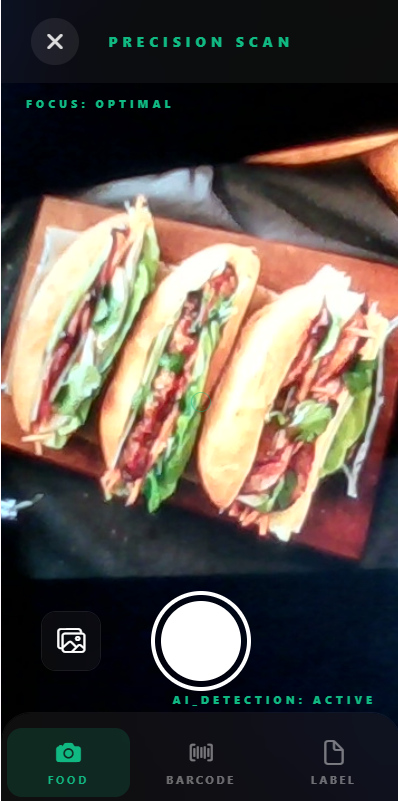
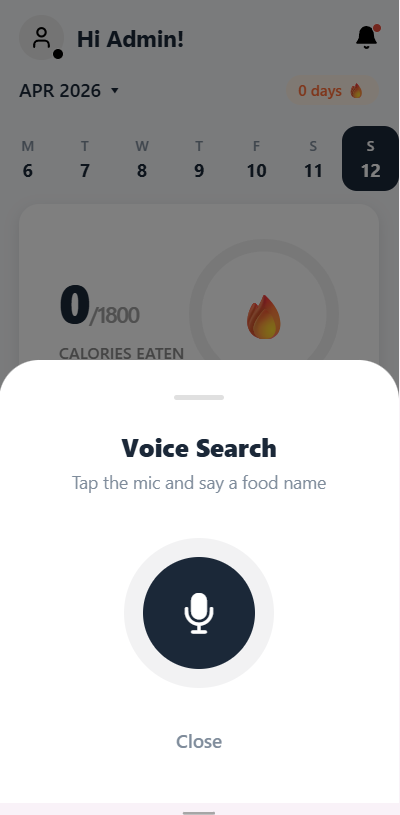

# 4.7.3 Giọng Nói & Camera

Hai trong ba phương thức log bữa ăn của NutriTrack dùng phần cứng — camera và micro. Ghi âm giọng nói gọi `aiEngine` trực tiếp; chụp ảnh route qua Lambda `scanImage` chuyên dụng, proxy đến ECS FastAPI để phân tích ảnh.

## Luồng chụp ảnh

### Quyền truy cập

`expo-camera` được cấu hình qua Expo config plugin — không cần sửa thủ công `Info.plist` / `AndroidManifest.xml`. Yêu cầu quyền lazily khi mở camera lần đầu:

```tsx
import { CameraView, useCameraPermissions } from 'expo-camera';

export function CameraScreen() {
  const [permission, requestPermission] = useCameraPermissions();

  if (!permission?.granted) {
    return (
      <View>
        <Text>Cần truy cập camera để log ảnh món ăn.</Text>
        <Button title="Cấp Quyền" onPress={requestPermission} />
      </View>
    );
  }

  return <CameraView style={{ flex: 1 }} facing="back" ref={cameraRef} />;
}
```

### Chụp → Upload S3

```tsx
import { uploadData } from 'aws-amplify/storage';
import * as FileSystem from 'expo-file-system';
import { randomUUID } from 'expo-crypto';

async function captureAndUpload(cameraRef: React.RefObject<CameraView>, userId: string) {
  // 1. Chụp ảnh
  const photo = await cameraRef.current?.takePictureAsync({ quality: 0.8 });
  if (!photo?.uri) throw new Error('Chụp ảnh thất bại');

  // 2. Đọc dạng blob
  const blob = await FileSystem.readAsStringAsync(photo.uri, {
    encoding: FileSystem.EncodingType.Base64,
  });
  const binary = Uint8Array.from(atob(blob), (c) => c.charCodeAt(0));

  // 3. Upload lên incoming/ — kích hoạt Lambda resizeImage
  const fileId = randomUUID();
  const s3Key = `incoming/${userId}/${fileId}.jpg`;
  await uploadData({
    path: s3Key,
    data: binary,
    options: { contentType: 'image/jpeg' },
  });

  return s3Key;
}
```

### Chờ và phân tích

Sau upload, `resizeImage` chạy nền (kích hoạt bởi S3 ObjectCreated). Sau đó gọi `scanImage` — Lambda xử lý ảnh chuyên dụng proxy đến ECS FastAPI:

```tsx
async function analyzePhoto(s3Key: string) {
  const res = await client.queries.scanImage({
    action: 'analyze-food',
    payload: JSON.stringify({ s3Key }),
  });
  const outer = JSON.parse(res.data ?? '{}');
  if (!outer.success) throw new Error(outer.error);
  return JSON.parse(outer.text); // JSON dinh dưỡng từ ECS FastAPI
}
```

`s3Key` là key `incoming/` — `scan-image` tải trực tiếp từ S3 (file chưa bị xóa; lifecycle rule chỉ hết hạn sau 24 giờ). Lambda chuyển tiếp đến ECS FastAPI và poll kết quả.

### Luồng camera đầy đủ

```text
User tap camera → yêu cầu quyền → CameraView toàn màn hình
  → user lấy góc → tap nút chụp
  → takePictureAsync()
  → uploadData() lên incoming/{userId}/{uuid}.jpg
  → S3 ObjectCreated → resizeImage chạy → media/{userId}/{uuid}.jpg được ghi
  → client.queries.scanImage({ action: 'analyze-food', s3Key })
  → scan-image Lambda: S3 GetObject → JWT auth → POST /analyze-food (ECS)
  → ECS FastAPI: poll /jobs/{job_id} mỗi 3 s → trả JSON dinh dưỡng
  → FoodDetailSheet trượt lên với nutrition card
  → user xác nhận → mealService.logMeal() → FoodLog.create() trong DynamoDB
```

### UI patterns

- `CameraView` toàn màn hình với overlay bán trong suốt và nút shutter ở giữa.
- Đang upload: spinner tiến trình phủ lên frame vừa chụp.
- `aiEngine` đang xử lý: skeleton nutrition card với shimmer animation.
- Lỗi AI: nút "Thử lại" và fallback nhập thủ công.



## Luồng ghi âm giọng nói

### Quyền truy cập micro

`expo-av` xử lý ghi âm; quyền được yêu cầu lazily:

```tsx
import { Audio } from 'expo-av';

async function requestMicPermission() {
  const { granted } = await Audio.requestPermissionsAsync();
  if (!granted) throw new Error('Bị từ chối quyền micro');
}
```

### Ghi âm → Upload S3

```tsx
import { Audio } from 'expo-av';
import { uploadData } from 'aws-amplify/storage';

let recording: Audio.Recording | null = null;

async function startRecording() {
  await Audio.setAudioModeAsync({ allowsRecordingIOS: true, playsInSilentModeIOS: true });
  const { recording: rec } = await Audio.Recording.createAsync(
    Audio.RecordingOptionsPresets.HIGH_QUALITY
  );
  recording = rec;
}

async function stopAndUpload(userId: string): Promise<string> {
  if (!recording) throw new Error('Không có recording đang chạy');
  await recording.stopAndUnloadAsync();

  const uri = recording.getURI();
  if (!uri) throw new Error('Không có URI recording');

  const blob = await fetch(uri).then((r) => r.blob());
  const fileId = randomUUID();
  const s3Key = `voice/${userId}/${fileId}.m4a`;

  await uploadData({
    path: s3Key,
    data: blob,
    options: { contentType: 'audio/m4a' },
  });

  return s3Key;
}
```

### Transcribe + AI parse

```tsx
async function voiceToFood(s3Key: string) {
  const res = await client.queries.aiEngine({
    action: 'voiceToFood',
    payload: JSON.stringify({ s3Key }),
  });
  const outer = JSON.parse(res.data ?? '{}');
  if (!outer.success) throw new Error(outer.error);

  const result = JSON.parse(outer.text);
  // result.action === 'log' | 'clarify'
  // result.food_data — object dinh dưỡng nếu action === 'log'
  // result.clarification_question_vi — câu hỏi nếu action === 'clarify'
  return result;
}
```

Bên trong `aiEngine`, Lambda khởi động Amazon Transcribe job với `LanguageCode: 'vi-VN'`, poll đến khi xong (tối đa 50 giây), rồi gửi transcript đến Qwen3-VL qua `VOICE_SYSTEM_PROMPT`. Qwen trả về `action: 'log'` với JSON món ăn đầy đủ, hoặc `action: 'clarify'` kèm câu hỏi (ví dụ: `"Phở bò hay phở gà nè?"`).

### Luồng giọng nói đầy đủ

```text
User giữ nút micro → Audio.Recording bắt đầu
  → animation waveform chạy
  → user thả → ghi âm dừng
  → uploadData() lên voice/{userId}/{uuid}.m4a
  → client.queries.aiEngine({ action: 'voiceToFood', s3Key })
  → aiEngine: StartTranscriptionJob → poll → transcript
  → aiEngine: Qwen(VOICE_SYSTEM_PROMPT, transcript) → JSON
  → nếu action === 'log': hiện FoodDetailSheet
  → nếu action === 'clarify': hiện prompt hỏi lại, chờ user trả lời
  → user xác nhận → mealService.logMeal()
```



## Các trạng thái lỗi

| Lỗi | User thấy gì | Khôi phục |
| --- | --- | --- |
| Bị từ chối quyền (camera/micro) | Giải thích + link settings | Tap để mở system settings |
| Upload thất bại | Toast: "Upload thất bại, thử lại" | Nút retry; fallback nhập thủ công |
| `Transcription timed out` | Toast: "Không nhận dạng được giọng" | Retry hoặc chuyển camera/thủ công |
| `aiEngine` trả về `action: 'clarify'` | Dialog câu hỏi tiếp theo | User gõ hoặc ghi âm lại |
| Bedrock bị throttle | Toast: "AI đang bận, đang thử lại…" | SDK retry với backoff; user thấy spinner |

## Lưu ý bảo mật

- File voice upload lên `voice/` **không** tự xóa sau transcription (code xóa bị comment trong `aiEngine/handler.ts` để dễ debug). Triển khai lifecycle rule trên `voice/` hoặc thêm xóa sau transcription nếu cần tuân thủ GDPR.
- Upload camera vào `incoming/` hết hạn bởi lifecycle rule sau 24 giờ.
- Presigned URL S3 cho `voice/` yêu cầu caller xác thực qua Cognito (enforce bởi access rule storage trong `storage/resource.ts`).

## Liên kết

- [4.3.3 S3 Storage](/workshop/4.3.3-S3-Storage)
- [4.5.2 AIEngine](/workshop/4.5.2-AIEngine)
- [4.5.4 ResizeImage](/workshop/4.5.4-ResizeImage)
