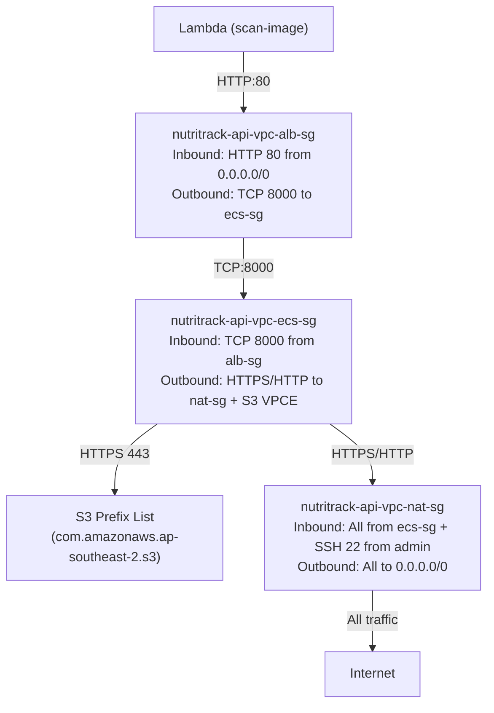

# 4.8.1 VPC & Network Setup

Hướng dẫn này thiết lập nền tảng mạng AWS cho NutriTrack API: VPC riêng, 4 subnets trên 2 AZ, Internet Gateway, Route Tables, 3 Security Groups, và S3 Gateway VPC Endpoint.

> **Region:** `ap-southeast-2` (Sydney) | **Thời gian ước tính:** 45–60 phút

## Tại sao chọn kiến trúc này?

| Quyết định | Lý do |
| :--- | :--- |
| **ECS Private Subnet** | Container không có IP public → không ai tấn công trực tiếp được |
| **ALB Internet-facing** | Điểm duy nhất nhận request từ internet, che giấu IP container |
| **NAT Instance** (thay NAT Gateway) | Tiết kiệm **~70%** chi phí ($10/tháng vs $34/tháng) |
| **S3 Gateway VPCE** | Truy cập S3 **miễn phí**, không qua internet, không qua NAT |
| **NAT Instance × 2 (1 mỗi AZ)** | HA thực sự: AZ này sập, AZ kia vẫn chạy bình thường |
| **Fargate SPOT ARM64** | Tiết kiệm thêm 70% chi phí compute |

## Nguồn Internet của từng thành phần

| Thành phần | Cách ra Internet | Chi phí |
| :--- | :--- | :--- |
| S3 `nutritrack-cache-*` | **S3 Gateway VPCE** — private, không qua NAT | **Miễn phí** |
| Bedrock Runtime | NAT Instance → Internet | Tính vào data transfer |
| Secrets Manager | NAT Instance → Internet | Tính vào data transfer |
| CloudWatch Logs | NAT Instance → Internet | Tính vào data transfer |
| Docker Hub pull | NAT Instance → Internet | Tính vào data transfer |
| External API (USDA, Avocavo, OpenFoodFacts) | NAT Instance → Internet | Tính vào data transfer |

---

## 1. Tạo VPC

**VPC (Virtual Private Cloud)** là mạng riêng ảo của bạn trên AWS. Mọi tài nguyên (ECS, ALB, NAT Instance...) đều nằm trong VPC này.

### 1.1 Tạo VPC

1. Đăng nhập **AWS Console** → Region **`ap-southeast-2`** (Sydney).
1. Tìm kiếm **VPC** → Click **VPC**.
1. Cột trái → **Your VPCs** → Nhấn **Create VPC**.
1. Cấu hình:

| Field | Giá trị |
| :--- | :--- |
| **Resources to create** | `VPC only` |
| **Name tag** | `nutritrack-api-vpc` |
| **IPv4 CIDR** | `10.0.0.0/16` |
| **IPv6 CIDR** | No IPv6 CIDR block |
| **Tenancy** | Default |

1. Nhấn **Create VPC**.

### 1.2 Bật DNS cho VPC

Sau khi tạo xong, bật 2 tính năng DNS để ECS và VPC Endpoint hoạt động đúng:

1. Chọn VPC `nutritrack-api-vpc` → **Actions** → **Edit VPC settings**.
1. Bật **2 checkbox**:
   - ✅ `Enable DNS resolution` — cho phép resolve hostname nội bộ
   - ✅ `Enable DNS hostnames` — gán hostname cho EC2/ENI trong VPC
1. Nhấn **Save**.

> **Tại sao cần bật DNS?** VPC Endpoint Interface dùng DNS private để resolve địa chỉ AWS services (VD: `s3.ap-southeast-2.amazonaws.com`). Không bật DNS → endpoint không hoạt động.

---

## 2. Tạo Subnets

Hệ thống dùng **4 subnets** trên **2 Availability Zone** (`ap-southeast-2a` và `ap-southeast-2c`):

| Subnet | AZ | CIDR | Loại |
| :--- | :--- | :--- | :--- |
| `nutritrack-api-vpc-public-alb01` | ap-southeast-2a | `10.0.1.0/24` | Public (ALB + NAT Instance #1) |
| `nutritrack-api-vpc-public-alb02` | ap-southeast-2c | `10.0.2.0/24` | Public (ALB + NAT Instance #2) |
| `nutritrack-api-vpc-private-ecs01` | ap-southeast-2a | `10.0.3.0/24` | Private (ECS Tasks) |
| `nutritrack-api-vpc-private-ecs02` | ap-southeast-2c | `10.0.4.0/24` | Private (ECS Tasks) |

### 2.1 Tạo tất cả 4 subnets

1. VPC Console → **Subnets** → **Create subnet**.
1. **VPC ID**: Chọn `nutritrack-api-vpc`.
1. Cấu hình lần lượt từng subnet bằng nút **Add new subnet**, điền theo bảng trên.
1. Nhấn **Create subnet** để tạo tất cả 4 subnets cùng lúc.

### 2.2 Bật Auto-assign Public IP cho Public Subnets

NAT Instance cần có địa chỉ IP public để ra Internet. Bật tính năng này cho 2 public subnets:

1. Chọn `nutritrack-api-vpc-public-alb01` → **Actions** → **Edit subnet settings**.
1. Tick **Enable auto-assign public IPv4 address** → **Save**.
1. Lặp lại cho `nutritrack-api-vpc-public-alb02`.

> **Không bật** cho 2 private subnets — ECS Tasks không cần và không được có IP public.

---

## 3. Internet Gateway & Route Tables

### 3.1 Tạo Internet Gateway

Internet Gateway là "cổng ra Internet" cho các tài nguyên trong VPC.

1. VPC Console → **Internet gateways** → **Create internet gateway**.
1. **Name tag**: `nutritrack-api-igw` → **Create internet gateway**.
1. Sau khi tạo → **Actions** → **Attach to VPC** → Chọn `nutritrack-api-vpc` → **Attach internet gateway**.

### 3.2 Public Route Table

Route Table xác định "traffic đi đâu". Public RT cho phép traffic ra Internet qua IGW.

1. VPC Console → **Route tables** → **Create route table**.

| Field | Giá trị |
| :--- | :--- |
| **Name** | `nutritrack-api-public-rt` |
| **VPC** | `nutritrack-api-vpc` |

1. Nhấn **Create route table**.
1. Chọn `nutritrack-api-public-rt` → tab **Routes** → **Edit routes** → **Add route**:
   - **Destination**: `0.0.0.0/0` | **Target**: `Internet Gateway` → chọn `nutritrack-api-igw`
1. Tab **Subnet associations** → **Edit subnet associations** → Tick cả 2 public subnets:
   - ✅ `nutritrack-api-vpc-public-alb01`
   - ✅ `nutritrack-api-vpc-public-alb02`
1. Nhấn **Save associations**.

### 3.3 Private Route Table AZ-2a

> ⚠️ **Lưu ý:** Tạo route table trước, **chưa thêm route NAT**. Route NAT (`0.0.0.0/0 → NAT Instance`) sẽ thêm sau khi NAT Instance tạo xong (xem [4.8.4 NAT Instance](/workshop/4.8-Verify-Setup/4.8.4-NAT-Instance)).

1. Tạo route table với **Name**: `nutritrack-api-private-rt-01`, **VPC**: `nutritrack-api-vpc`.
1. Tab **Subnet associations** → Gắn `nutritrack-api-vpc-private-ecs01`.

### 3.4 Private Route Table AZ-2c

1. Tạo route table với **Name**: `nutritrack-api-private-rt-02`, **VPC**: `nutritrack-api-vpc`.
1. Tab **Subnet associations** → Gắn `nutritrack-api-vpc-private-ecs02`.

---

## 4. Security Groups

Security Group là **tường lửa ảo** cấp port/protocol. Tạo theo đúng thứ tự sau vì SG sau cần tham chiếu SG trước.

**Thứ tự:** ALB SG → ECS SG → NAT SG → Quay lại edit ALB SG Outbound

### 4.1 ALB Security Group — `nutritrack-api-vpc-alb-sg`

Gắn vào **Application Load Balancer**. ALB nhận HTTP từ Internet rồi forward vào ECS Tasks.

1. VPC Console → **Security groups** → **Create security group**.

| Field | Giá trị |
| :--- | :--- |
| **Security group name** | `nutritrack-api-vpc-alb-sg` |
| **Description** | `ALB Security Group - receives HTTP from internet` |
| **VPC** | `nutritrack-api-vpc` |

**Inbound Rules (traffic vào ALB):**

| Type | Protocol | Port | Source | Mục đích |
| :--- | :--- | :--- | :--- | :--- |
| HTTP | TCP | 80 | `0.0.0.0/0` | Nhận request HTTP từ Lambda `scan-image` |

> ⚠️ **Cần cập nhật sau:** Source `0.0.0.0/0` ở đây là tạm thời. Sau khi hoàn thành [4.5.5 ScanImage](/workshop/4.5.5-ScanImage) và Lambda `scan-image` được gắn vào VPC với security group riêng (`scan-image-sg`), hãy quay lại đây và đổi source từ `0.0.0.0/0` thành `scan-image-sg` — chỉ cho phép đúng Lambda gọi vào ALB.

**Outbound Rules:** Tạm giữ mặc định `All traffic 0.0.0.0/0` — sẽ update ở bước 4.4 sau khi ECS SG có.

1. Nhấn **Create security group**.

---

### 4.2 ECS Security Group — `nutritrack-api-vpc-ecs-sg`

Gắn vào **ECS Fargate Tasks**. Tasks chỉ nhận từ ALB, chỉ gửi ra NAT Instance hoặc S3 VPCE.

| Field | Giá trị |
| :--- | :--- |
| **Security group name** | `nutritrack-api-vpc-ecs-sg` |
| **Description** | `ECS Task SG - only from ALB, out to NAT or S3 VPCE` |
| **VPC** | `nutritrack-api-vpc` |

**Inbound Rules:**

| Type | Protocol | Port | Source | Mục đích |
| :--- | :--- | :--- | :--- | :--- |
| Custom TCP | TCP | 8000 | `nutritrack-api-vpc-alb-sg` | **Chỉ nhận** request từ ALB |

> **Tại sao Source là SG thay vì IP?** ALB có thể có nhiều IP (một IP mỗi AZ, thay đổi theo thời gian). Dùng SG reference đảm bảo luôn đúng.

**Outbound Rules:**

| Type | Protocol | Port | Destination | Mục đích |
| :--- | :--- | :--- | :--- | :--- |
| HTTPS | TCP | 443 | `nutritrack-api-vpc-nat-sg` | Gọi Bedrock, Secrets Manager, CloudWatch, Docker Hub |
| HTTP | TCP | 80 | `nutritrack-api-vpc-nat-sg` | Một số External APIs dùng HTTP |
| HTTPS | TCP | 443 | S3 prefix list (xem bước 5.3) | Gọi S3 qua Gateway VPCE |

> ⚠️ Rule S3 prefix list chưa thể thêm ngay. Sau khi tạo S3 VPCE ở Phần 5, quay lại edit thêm rule với Destination là **Managed prefix list**: `com.amazonaws.ap-southeast-2.s3`.

---

### 4.3 NAT Instance Security Group — `nutritrack-api-vpc-nat-sg`

Gắn vào **NAT Instance**. NAT nhận traffic từ ECS (forward ra Internet) và cho phép SSH từ admin.

| Field | Giá trị |
| :--- | :--- |
| **Security group name** | `nutritrack-api-vpc-nat-sg` |
| **Description** | `NAT Instance SG - forward ECS outbound, allow SSH from admin` |
| **VPC** | `nutritrack-api-vpc` |

**Inbound Rules:**

| Type | Protocol | Port | Source | Mục đích |
| :--- | :--- | :--- | :--- | :--- |
| All traffic | All | All | `nutritrack-api-vpc-ecs-sg` | Nhận tất cả traffic từ ECS để forward |
| SSH | TCP | 22 | `<YOUR_PC_IP>/32` | SSH từ máy admin để cài đặt |

> **Cách lấy IP máy bạn:** Truy cập [https://checkip.amazonaws.com](https://checkip.amazonaws.com). Thay `<YOUR_PC_IP>` bằng IP đó (VD: `123.45.67.89/32`). **Không bao giờ mở SSH `0.0.0.0/0`**.

**Outbound Rules:**

| Type | Protocol | Port | Destination | Mục đích |
| :--- | :--- | :--- | :--- | :--- |
| All traffic | All | All | `0.0.0.0/0` | Forward traffic ra Internet |

---

### 4.4 Quay lại Edit Outbound của ALB SG

Giờ ECS SG đã có, cập nhật Outbound rule cho ALB SG:

1. VPC Console → **Security groups** → Chọn `nutritrack-api-vpc-alb-sg`.
1. Tab **Outbound rules** → **Edit outbound rules** → **Add rule**:
   - Type: `Custom TCP` | Protocol: `TCP` | Port: `8000` | Destination: `nutritrack-api-vpc-ecs-sg`
1. **Xóa** rule `All traffic 0.0.0.0/0` mặc định nếu còn.
1. Nhấn **Save rules**.

### 4.5 Sơ đồ Security Group Chain

---

## 5. S3 Gateway VPC Endpoint

S3 Gateway VPC Endpoint cho phép ECS Tasks gọi S3 **qua private link nội bộ AWS** — không đi qua Internet, không qua NAT Instance → **hoàn toàn miễn phí** và nhanh hơn.

### 5.1 Tạo S3 Gateway Endpoint

1. VPC Console → **Endpoints** → **Create endpoint**.

| Field | Giá trị |
| :--- | :--- |
| **Name tag** | `nutritrack-api-vpc-s3-vpce` |
| **Service category** | `AWS services` |
| **Services** | Tìm `com.amazonaws.ap-southeast-2.s3` → chọn **Type: Gateway** |
| **VPC** | `nutritrack-api-vpc` |

1. **Route tables** — Tick cả 2 private route tables:
   - ✅ `nutritrack-api-private-rt-01`
   - ✅ `nutritrack-api-private-rt-02`

> **Tại sao chọn cả 2?** AWS tự động thêm route đến S3 vào mỗi route table. ECS Tasks ở cả 2 AZ đều có thể truy cập S3 qua VPCE.

1. **Policy**: Giữ `Full access` (mặc định) → Nhấn **Create endpoint**.

### 5.2 Verify

Kiểm tra 2 private route tables đã có route S3:

1. VPC Console → **Route tables** → Chọn `nutritrack-api-private-rt-01` → tab **Routes**.
1. Phải thấy: `pl-xxxxxxxx (com.amazonaws.ap-southeast-2.s3)` → Target: `vpce-xxxxxxxxx`.
1. Lặp lại cho `nutritrack-api-private-rt-02`.

### 5.3 Cập nhật ECS SG Outbound cho S3

1. **Security groups** → `nutritrack-api-vpc-ecs-sg` → Tab **Outbound rules** → **Edit outbound rules**.
1. Thêm rule: Type `HTTPS` | Port `443` | Destination: chọn **Prefix list** → `com.amazonaws.ap-southeast-2.s3`.
1. **Save rules**.

---

## Liên kết

- [4.8.2 Fargate & ALB](/workshop/4.8-Verify-Setup/4.8.2-Fargate-ALB) — ECS Cluster, Task Definition, Service, Load Balancer
- [4.8.3 Infrastructure](/workshop/4.8-Verify-Setup/4.8.3-Infrastructure) — S3 Bucket, Secrets Manager, IAM Roles
- [4.8.4 NAT Instance](/workshop/4.8-Verify-Setup/4.8.4-NAT-Instance) — Setup NAT Instance, cập nhật Route Tables
