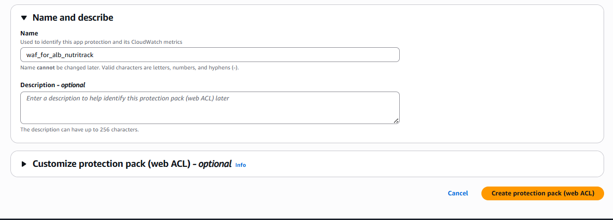
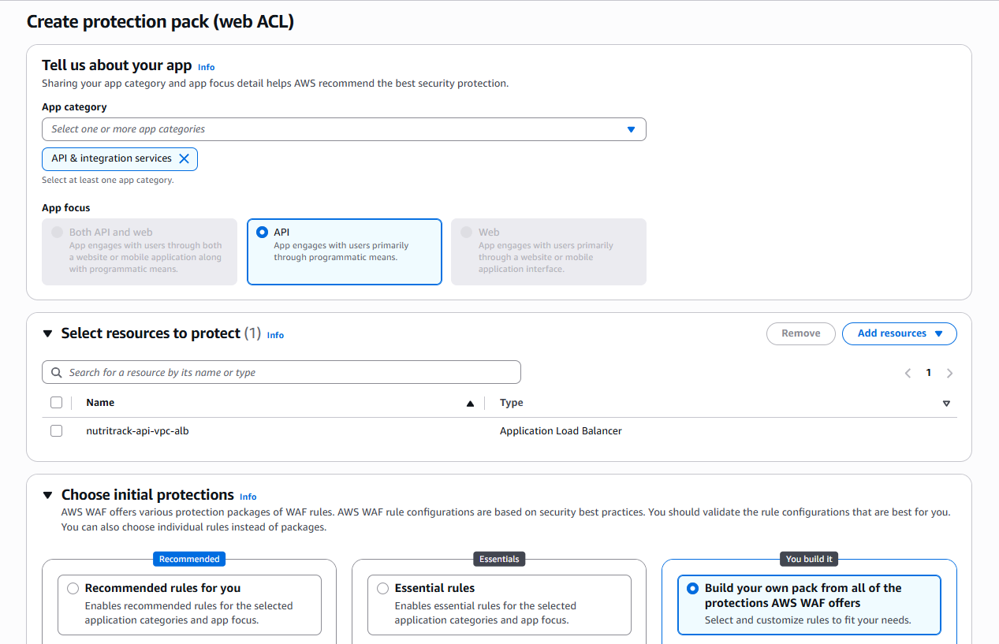
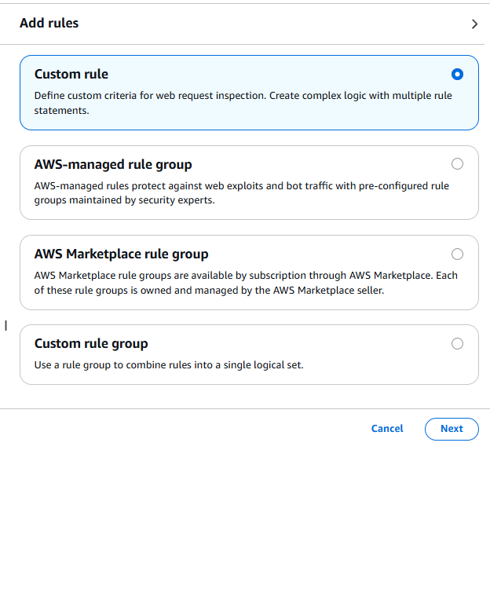
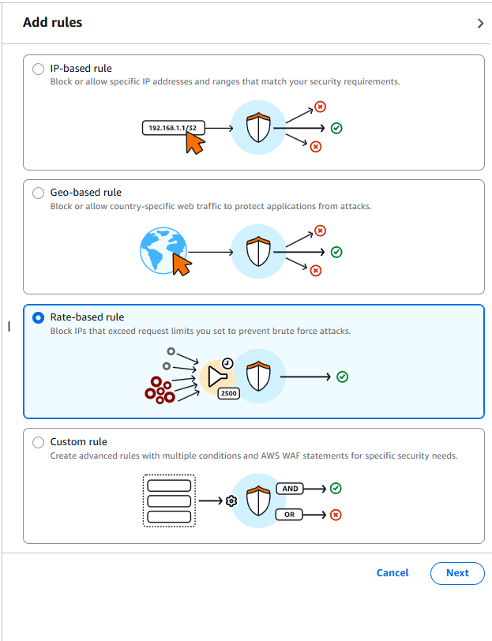
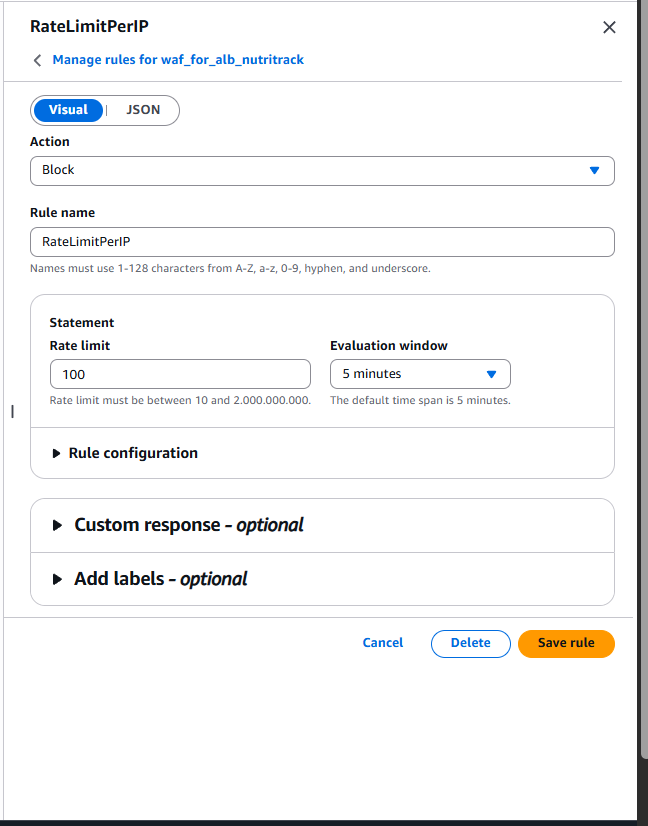
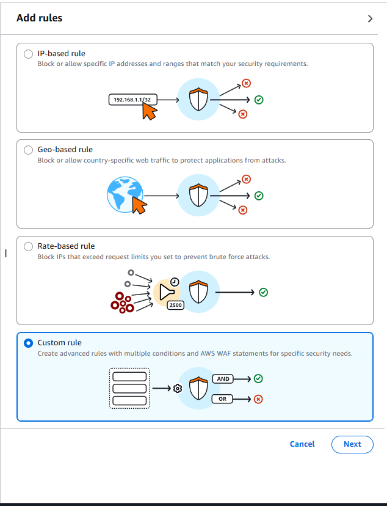
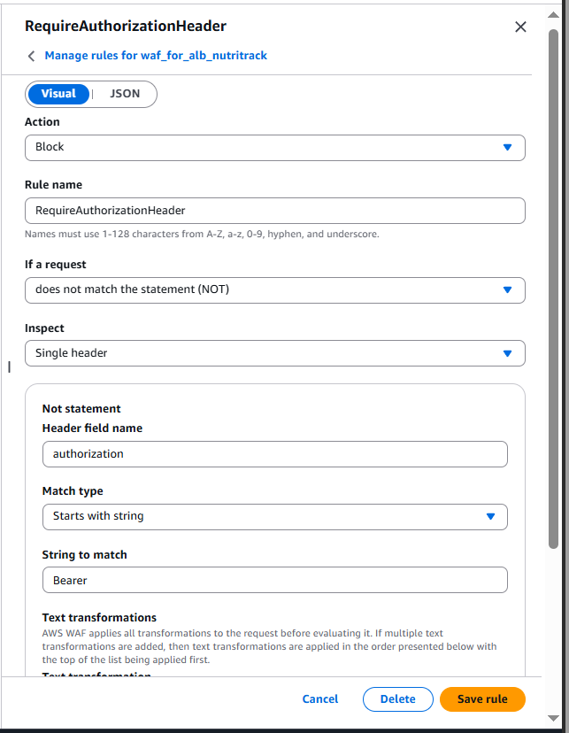

# 4.8.2 Fargate & ALB

This section covers building and pushing the Docker image, then setting up the ECS Cluster, Task Definition, ALB, Target Group, ECS Service, and Auto Scaling — all through the AWS Console.

## Build & Push the Docker Image

Before defining the ECS Task, the application image must be on Docker Hub.

### Clone the source

```bash
git clone https://github.com/justHman/NUTRI_TRACK
cd NUTRI_TRACK
```

### Build and push ARM64 image

ECS Fargate on Graviton requires a `linux/arm64` image. Build with `buildx` and push directly:

```bash
# Log in to Docker Hub
docker login

# Enable multi-architecture builds (first time only)
docker buildx create --use --name mybuilder

# Build and push — replace <your-dockerhub-username> with your Docker Hub username
docker buildx build \
  --platform linux/arm64 \
  --tag <your-dockerhub-username>/nutritrack-api-image:arm-latest \
  --push \
  .
```

> Graviton (ARM64) + Fargate Spot gives up to 20% better price/performance. The task definition in the next step references this exact tag.

---

## ECS Cluster

1. AWS Console → **ECS** → **Clusters** → **Create cluster**.

| Field | Value |
| :---- | :---- |
| **Cluster name** | `nutritrack-api-cluster` |
| **Infrastructure** | `AWS Fargate (serverless)` |

1. Optionally enable **Container Insights** under Monitoring (adds ≈$2–5/month but provides detailed metrics).
1. Click **Create**.

---

## Task Definition

The Task Definition specifies which container image to run, how much CPU and RAM to allocate, and how to pass secrets.

1. ECS Console → **Task definitions** → **Create new task definition**.

**Task configuration:**

| Field | Value |
| :---- | :---- |
| **Task definition family** | `arm-nutritrack-api-task` |
| **Launch type** | `AWS Fargate` |
| **OS/Architecture** | `Linux/ARM64` |
| **CPU** | `1 vCPU` |
| **Memory** | `2 GB` |
| **Task execution role** | `ecsTaskExecutionRole` |
| **Task role** | `ecsTaskRole` |

**Container configuration:**

| Field | Value |
| :---- | :---- |
| **Name** | `arm-nutritrack-api-container` |
| **Image URI** | `<your-dockerhub-username>/nutritrack-api-image:arm-latest` |
| **Container port** | `8000` |
| **Protocol** | `TCP` |

> The workflow pushes two tags: `:arm-latest` (always current) and `:arm-DDMMYY` (date-pinned for rollback). The task definition uses `:arm-latest` so each forced redeploy pulls the newest image.

**Environment variables:**

| Key | Type | Value |
| :-- | :--- | :---- |
| `AWS_DEFAULT_REGION` | Value | `ap-southeast-2` |
| `AWS_S3_CACHE_BUCKET` | Value | Your S3 bucket name |
| `NUTRITRACK_API_KEY` | ValueFrom | `<SECRET_ARN>:NUTRITRACK_API_KEY::` |
| `USDA_API_KEY` | ValueFrom | `<SECRET_ARN>:USDA_API_KEY::` |
| `AVOCAVO_API_KEY` | ValueFrom | `<SECRET_ARN>:AVOCAVO_API_KEY::` |

> **`ValueFrom` syntax:** `[ARN]:[KEY_NAME]::` — the two trailing `::` are required; omitting them causes a deployment error.

**Logging:**

| Field | Value |
| :---- | :---- |
| **Log driver** | `awslogs` |
| **awslogs-group** | `/ecs/arm-nutritrack-api-task` |
| **awslogs-region** | `ap-southeast-2` |
| **awslogs-stream-prefix** | `ecs` |

1. Click **Create**.

---

## Target Group

The Target Group tells the ALB where to route traffic and how to health-check the container.

1. EC2 Console → **Target Groups** → **Create target group**.

| Field | Value |
| :---- | :---- |
| **Target type** | `IP addresses` — **required for Fargate** (awsvpc mode assigns ENIs, not instance IPs) |
| **Target group name** | `nutritrack-api-vpc-tg` |
| **Protocol** | `HTTP` |
| **Port** | `8000` |
| **VPC** | `nutritrack-api-vpc` |
| **Protocol version** | `HTTP1` |

**Health checks:**

| Field | Value | Reason |
| :---- | :---- | :----- |
| **Protocol** | HTTP | |
| **Path** | `/health` | FastAPI health endpoint |
| **Healthy threshold** | `2` | Faster healthy detection (default 5 = 2.5× slower) |
| **Unhealthy threshold** | `3` | |
| **Interval** | `10` seconds | More frequent than the 30s default |
| **Timeout** | `5` seconds | |
| **Success codes** | `200` | |

1. Click **Next** → **Create target group** (no manual IP registration needed — ECS registers tasks automatically).

---

## Application Load Balancer

1. EC2 Console → **Load Balancers** → **Create Load Balancer** → **Application Load Balancer** → **Create**.

| Field | Value |
| :---- | :---- |
| **Load balancer name** | `nutritrack-api-vpc-alb` |
| **Scheme** | `Internet-facing` |
| **IP address type** | `IPv4` |

**Network mapping:**

| Field | Value |
| :---- | :---- |
| **VPC** | `nutritrack-api-vpc` |
| **Mappings** | `ap-southeast-2a` → `nutritrack-api-vpc-public-alb01` |
| | `ap-southeast-2c` → `nutritrack-api-vpc-public-alb02` |

**Security groups:** Select `nutritrack-api-vpc-alb-sg`.

**Listeners and routing:**

- **Protocol**: `HTTP` | **Port**: `80`
- **Default action**: Forward to `nutritrack-api-vpc-tg`

1. Click **Create load balancer**.
1. Wait ~3 minutes for the status to become **Active**.
1. Copy the **DNS name** (e.g. `nutritrack-api-vpc-alb-xxxxxxxxx.ap-southeast-2.elb.amazonaws.com`) — this is the public URL and will be set as `ECS_BASE_URL` in the `scanImage` Lambda.

---

## AWS WAF — Web ACL for the ALB

Once the ALB is active, attach a Web ACL to protect it from brute-force and unauthenticated access.

### Create the Web ACL

1. AWS Console → **WAF & Shield** → **Web ACLs** → **Create web ACL**.
1. Set the name to `waf_for_alb_nutritrack`, select **Regional** scope, and choose the region where your ALB lives (`ap-southeast-2`).



1. Under **Associated AWS resources**, click **Add AWS resources** → select the ALB `nutritrack-api-vpc-alb` → **Add**.



### Add a rate-based rule — RateLimitPerIP

This rule blocks any single IP that sends more than 100 requests within a 5-minute window, protecting against brute-force login and scanning attacks.

1. On the **Add rules and rule groups** step, click **Add rules** → **Add my own rules and rule groups**.
1. Select **Rate-based rule**.



1. Configure the rule:

| Field | Value |
| :---- | :---- |
| **Rule name** | `RateLimitPerIP` |
| **Rate limit** | `100` |
| **Evaluation window** | `5 minutes` |
| **Aggregation key** | `IP address` |
| **Action** | `Block` |





1. Click **Add rule**.

### Add a custom rule — RequireAuthorizationHeader

This rule blocks any request that does not carry an `Authorization: Bearer` header, ensuring that only requests from the `scan-image` Lambda (which always attaches the JWT) reach the container.

1. Click **Add rules** → **Add my own rules and rule groups** again.
1. Select **Rule builder** (custom rule).



1. Configure the rule:

| Field | Value |
| :---- | :---- |
| **Rule name** | `RequireAuthorizationHeader` |
| **Type** | Regular rule |
| **If a request** | `does not match the statement` |
| **Inspect** | `Single header` → `authorization` |
| **Match type** | `Starts with string` → `Bearer` |
| **Action** | `Block` |



1. Click **Add rule** → **Next** → review → **Create web ACL**.

> **Rule priority:** `RateLimitPerIP` is evaluated before `RequireAuthorizationHeader`. A flood from one IP is blocked at the rate layer before the header check is even reached.

---

## ECS Service

The ECS Service keeps a running task connected to the ALB.

1. ECS Console → **Clusters** → `nutritrack-api-cluster` → **Services** tab → **Create**.

**Compute configuration:**

- **Capacity provider strategy** → **Add capacity provider**:
  - **Provider**: `FARGATE_SPOT` | **Weight**: `1`

**Deployment configuration:**

| Field | Value |
| :---- | :---- |
| **Application type** | `Service` |
| **Task definition** | `arm-nutritrack-api-task` (Latest revision) |
| **Service name** | `spot-arm-nutritrack-api-task-service` |
| **Desired tasks** | `1` |

**Deployment options:**

- **Deployment type**: Rolling update
- **Minimum healthy percent**: `50`
- **Maximum percent**: `200`

**Networking:**

| Field | Value |
| :---- | :---- |
| **VPC** | `nutritrack-api-vpc` |
| **Subnets** | `nutritrack-api-vpc-private-ecs01` ✅ + `nutritrack-api-vpc-private-ecs02` ✅ |
| **Security group** | `nutritrack-api-vpc-ecs-sg` |
| **Public IP** | **DISABLED** — tasks egress through the NAT Instance |

**Load balancing:**

| Field | Value |
| :---- | :---- |
| **Load balancing type** | `Application Load Balancer` |
| **Load balancer** | `nutritrack-api-vpc-alb` |
| **Listener** | `HTTP:80` |
| **Target group** | `nutritrack-api-vpc-tg` |
| **Health check grace period** | `60` seconds |

1. Click **Create**.

---

## Auto Scaling

Configure Step Scaling to add tasks when CPU is high and remove them when CPU is low.

### Enable Service Auto Scaling

1. ECS Console → **Clusters** → `nutritrack-api-cluster` → service `spot-arm-nutritrack-api-task-service`.
1. Confirm the service status is **ACTIVE** and the task is **RUNNING**.
1. Click **Update** (top-right corner).
1. Scroll to **Service auto scaling** → select **Use Service Auto Scaling**.
1. Set task limits:
   - **Minimum number of tasks**: `1`
   - **Maximum number of tasks**: `10`

### Scale-out policy (CPU ≥ 70% → add tasks)

1. **Scaling policy type**: `Step scaling`
2. **Policy name**: `nutritrack-api-cluster-cpu-above-70`
3. **Amazon ECS service alarm**: click **Create a new alarm using Amazon ECS metrics** — the browser opens CloudWatch in a new tab.

**In the CloudWatch tab:**

1. **Metric**: `CPUUtilization` | **Statistic**: `Average` | **Period**: `1 minute` → **Next**.
2. **Conditions**: Static, `Greater/Equal >=`, threshold `70`.
3. **Next** → click **Remove** to delete the default notification action → **Next**.
4. **Alarm name**: `nutritrack-api-cluster-cpu-above-70-alarm` → **Next** → **Create alarm**.

**Back in the ECS tab:**

- Click **Refresh (🔄)** next to the alarm field.
- Select `nutritrack-api-cluster-cpu-above-70-alarm`.
- **Scaling actions**:
  - **Action**: `Add` | **Value**: `10` | **Type**: `percent`
  - **Lower bound**: `70` (auto-filled) | **Upper bound**: leave blank (+infinity)
  - **Cooldown period**: `120` seconds
  - **Minimum adjustment magnitude**: `1`

### Scale-in policy (CPU ≤ 20% → remove tasks)

1. Click **Add more scaling policies**.
2. **Scaling policy type**: `Step scaling`
3. **Policy name**: `nutritrack-api-cluster-cpu-below-20`
4. **Amazon ECS service alarm**: **Create a new alarm using Amazon ECS metrics**.

**In the CloudWatch tab:**

1. **Metric**: `CPUUtilization` | **Statistic**: `Average` | **Period**: `1 minute` → **Next**.
2. **Conditions**: Static, `Less/Equal <=`, threshold `20`.
3. **Next** → **Remove** default action → **Next**.
4. **Alarm name**: `nutritrack-api-cluster-cpu-below-20-alarm` → **Next** → **Create alarm**.

**Back in the ECS tab:**

- Click **Refresh (🔄)**.
- Select `nutritrack-api-cluster-cpu-below-20-alarm`.
- **Scaling actions**:
  - **Action**: `Remove` | **Value**: `10` | **Type**: `percent`
  - **Lower bound**: leave blank (-infinity) | **Upper bound**: `20` (auto-filled)
  - **Cooldown period**: `300` seconds
  - **Minimum adjustment magnitude**: `1`

### Save and verify

- Scroll to the bottom and click **Update** to save both policies.
- Verify with the CLI:

```bash
# List the two scaling policies
aws application-autoscaling describe-scaling-policies \
  --service-namespace ecs \
  --resource-id "service/nutritrack-api-cluster/spot-arm-nutritrack-api-task-service" \
  --query "ScalingPolicies[].{PolicyName:PolicyName,Type:PolicyType}" \
  --output table

# Check alarm states
aws cloudwatch describe-alarms \
  --alarm-names \
    "nutritrack-api-cluster-cpu-above-70-alarm" \
    "nutritrack-api-cluster-cpu-below-20-alarm" \
  --query 'MetricAlarms[].{Name:AlarmName,State:StateValue}' \
  --output table
```

| Alarm | Trigger | Action | Cooldown |
| :---- | :------ | :----- | :------- |
| `nutritrack-api-cluster-cpu-above-70-alarm` | CPU ≥ 70% for 1 min | +10% tasks | 120 s |
| `nutritrack-api-cluster-cpu-below-20-alarm` | CPU ≤ 20% for 1 min | −10% tasks | 300 s |

> Asymmetric cooldowns: fast scale-out (120 s) to handle traffic spikes immediately; slow scale-in (300 s) to avoid task thrashing.

---

## Serverless → Container Authentication

ECS FastAPI only accepts requests that carry a valid JWT signed with the shared `NUTRITRACK_API_KEY` secret. This is how the `scan-image` Lambda generates that token and how the container validates it.

### Lambda side — JWT generation

Before every call to the ALB, `scan-image`:

1. Calls `secretsmanager:GetSecretValue` to retrieve `NUTRITRACK_API_KEY` (ARN: `arn:aws:secretsmanager:<region>:<account>:secret:nutritrack/prod/api-keys*`).
2. Constructs and signs a JWT using **HS256** with Node.js built-in `crypto`:

   ```typescript
   import { createHmac } from 'crypto';

   function buildJWT(secret: string): string {
     const header  = Buffer.from(JSON.stringify({ alg: 'HS256', typ: 'JWT' })).toString('base64url');
     const payload = Buffer.from(JSON.stringify({
       iss: 'nutritrack-scan-image',
       iat: Math.floor(Date.now() / 1000),
       exp: Math.floor(Date.now() / 1000) + 300,  // 5-minute TTL
     })).toString('base64url');
     const sig = createHmac('sha256', secret)
       .update(`${header}.${payload}`)
       .digest('base64url');
     return `${header}.${payload}.${sig}`;
   }
   ```

3. Sends the token as `Authorization: Bearer <token>` on every HTTP request to the ALB.

### Container side — JWT validation

The FastAPI middleware verifies every incoming request:

- Decodes the header and payload (base64url).
- Recomputes the HMAC-SHA256 signature using its own copy of `NUTRITRACK_API_KEY` (injected via the task's environment variable).
- Returns `401 Unauthorized` if the signature does not match or `exp` is in the past.

The task security group only allows inbound TCP 8000 from the ALB security group, so direct internet access is blocked at the network layer as well.

### Why HS256 over asymmetric keys?

Both the Lambda and the ECS container are internal AWS services in the same account. Symmetric HS256 is simpler to rotate (update one secret, redeploy both sides) and has no certificate management overhead. The 5-minute TTL limits the blast radius if a token is intercepted.

---

## Troubleshooting

| Symptom | Cause | Fix |
| :------ | :---- | :-- |
| Task stuck in PROVISIONING | Image pull fails | Verify NAT Instance route is healthy; confirm image URI is `<dockerhub-user>/nutritrack-api-image:arm-latest` |
| Task exits immediately | App crash on startup | CloudWatch → `/ecs/arm-nutritrack-api-task` → latest stream — usually a missing env var |
| ALB returns 502 | `/health` endpoint missing or container not started | Verify `GET /health` returns 200; check health check grace period |
| ALB returns 504 | Task-SG blocks ALB-SG on port 8000 | Verify Task-SG inbound rule allows TCP 8000 **from ALB-SG** |
| Autoscaling not triggering | Cooldown period still active | Wait for cooldown; check CloudWatch alarm state |

---

## Cost estimate

At 1 FARGATE_SPOT task × 1 vCPU / 2 GB RAM in ap-southeast-2 (2025 prices):

| Component | Monthly cost |
| :-------- | :----------- |
| Fargate Spot (ARM64, 1 task, 730 hrs) | ≈$5–10 |
| NAT Instance (2 × t4g.nano) | ≈$10.96 |
| ALB | ≈$16.20 |
| CloudWatch logs (30 days) | ≈$0.50 |
| **Total (excluding Bedrock)** | **≈$33–38** |

FARGATE_SPOT on ARM64 is significantly cheaper than on-demand x86. The dominant fixed cost is the ALB. See [4.8.4 NAT Instance](/workshop/4.8.4-NAT-Instance) for the NAT setup details.

---

## Cross-links

- [4.8.1 VPC & ECR](/workshop/4.8.1-VPC-ECR) — network and registry prerequisites.
- [4.8.3 Infrastructure](/workshop/4.8.3-Infrastructure) — Secrets Manager and IAM role setup.
- [4.8.4 NAT Instance](/workshop/4.8.4-NAT-Instance) — NAT Instance and Auto Scaling Group.
- [4.10 Cleanup](/workshop/4.10-Cleanup) — delete in order: service → task definitions → cluster → ALB → VPC.
