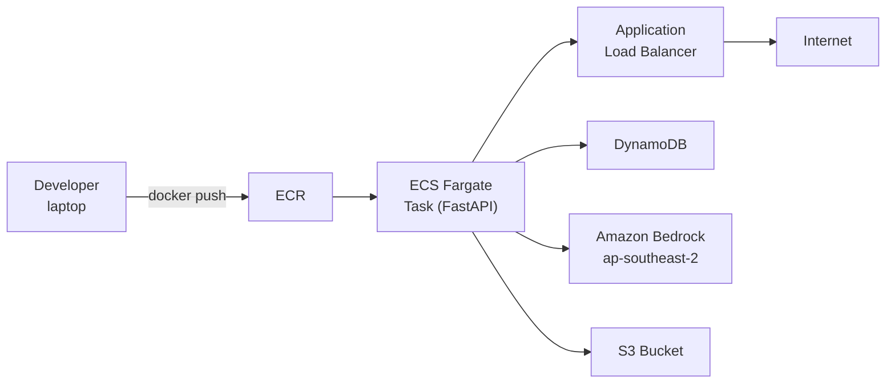

# 4.8 ECS Deployment — VPC, ECR, Fargate, ALB

The ECS Fargate tier runs a containerized FastAPI service alongside the serverless Amplify backend. It handles workloads that don't fit Lambda: long-running operations, custom ML inference, third-party API proxying, or tasks that benefit from a persistent process.

## Architecture

Fargate tasks run in private subnets; the ALB sits in public subnets and terminates TLS. Tasks reach AWS services via NAT Gateway or VPC endpoints.

## Cost note

The ECS tier is the biggest fixed cost in NutriTrack's architecture. Two tasks at 0.5 vCPU / 1 GB RAM plus one NAT Gateway in ap-southeast-2 runs approximately **$60–80 USD/month** even with zero traffic. If your use case can fit in Lambda, stay there. The ECS tier makes sense when you need:

- Persistent WebSocket connections.
- More than 15 minutes of compute (Lambda max).
- A pre-warmed process to avoid Lambda cold starts on latency-sensitive paths.
- A familiar Python/FastAPI deployment model.

## Sub-sections

- [4.8.1 VPC & ECR](/workshop/4.8.1-VPC-ECR) — network setup and container registry.
- [4.8.2 Fargate & ALB](/workshop/4.8.2-Fargate-ALB) — task definition, service, load balancer, deployment.
