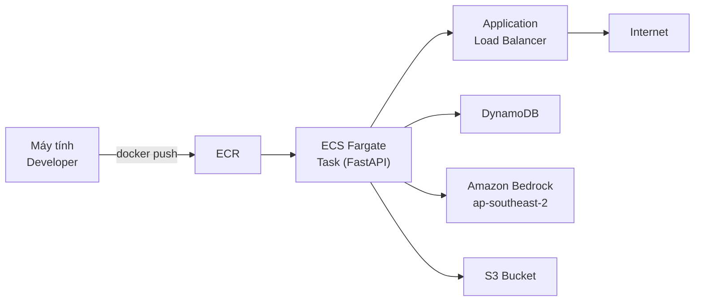

# 4.8 Triển Khai ECS — VPC, ECR, Fargate, ALB

Tầng ECS Fargate chạy một FastAPI service containerized song song với serverless Amplify backend. Nó xử lý workload không phù hợp với Lambda: tác vụ dài, custom ML inference, proxy API bên thứ ba, hoặc tác vụ cần tiến trình persistent.

## Kiến trúc

Fargate task chạy trong private subnet; ALB nằm trong public subnet và terminate TLS. Task tiếp cận AWS service qua NAT Gateway hoặc VPC endpoint.

## Lưu ý chi phí

Tầng ECS là chi phí cố định lớn nhất trong kiến trúc NutriTrack. Hai task ở 0.5 vCPU / 1 GB RAM cộng một NAT Gateway ở ap-southeast-2 tốn khoảng **$60–80 USD/tháng** dù không có traffic. Nếu use case có thể dùng Lambda, hãy ở lại đó. Tầng ECS có giá trị khi bạn cần:

- Kết nối WebSocket persistent.
- Hơn 15 phút compute (giới hạn Lambda).
- Tiến trình pre-warmed để tránh Lambda cold start trên đường dẫn nhạy cảm về latency.
- Mô hình triển khai Python/FastAPI quen thuộc.

## Các trang con

- [4.8.1 VPC & ECR](/workshop/4.8.1-VPC-ECR) — thiết lập mạng và container registry.
- [4.8.2 Fargate & ALB](/workshop/4.8.2-Fargate-ALB) — task definition, service, load balancer, triển khai.
